# LLM Compare - Architecture Documentation

## System Overview

LLM Compare is a multi-AI evaluation tool that orchestrates responses from multiple LLM providers and uses collaborative and adversarial strategies to evaluate, score, and rank the responses.

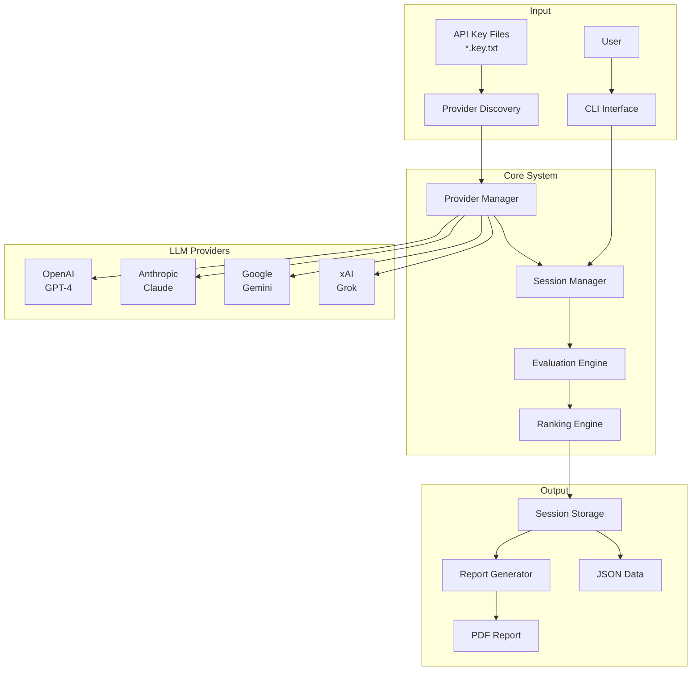

---

## Component Architecture

### High-Level Components

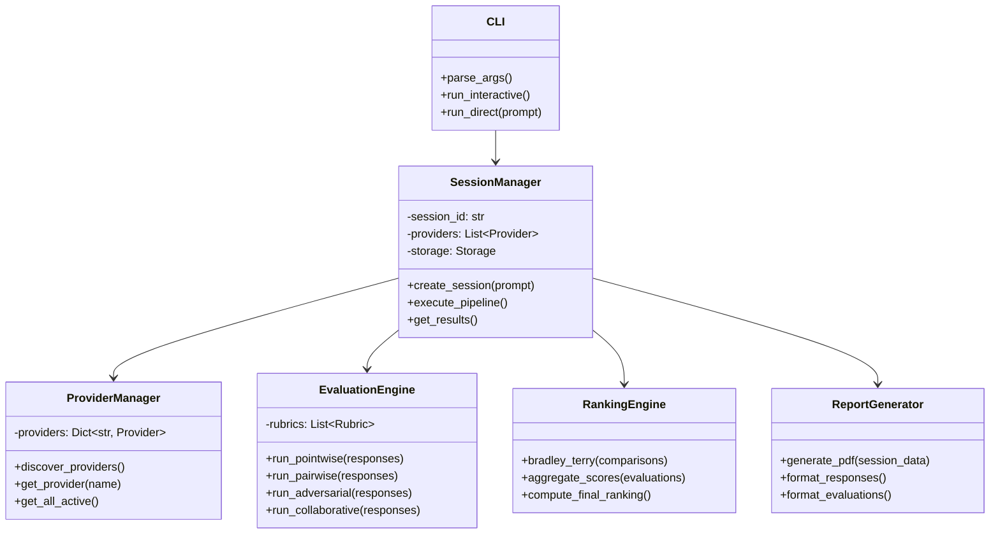

---

## Provider System

### Provider Discovery Flow

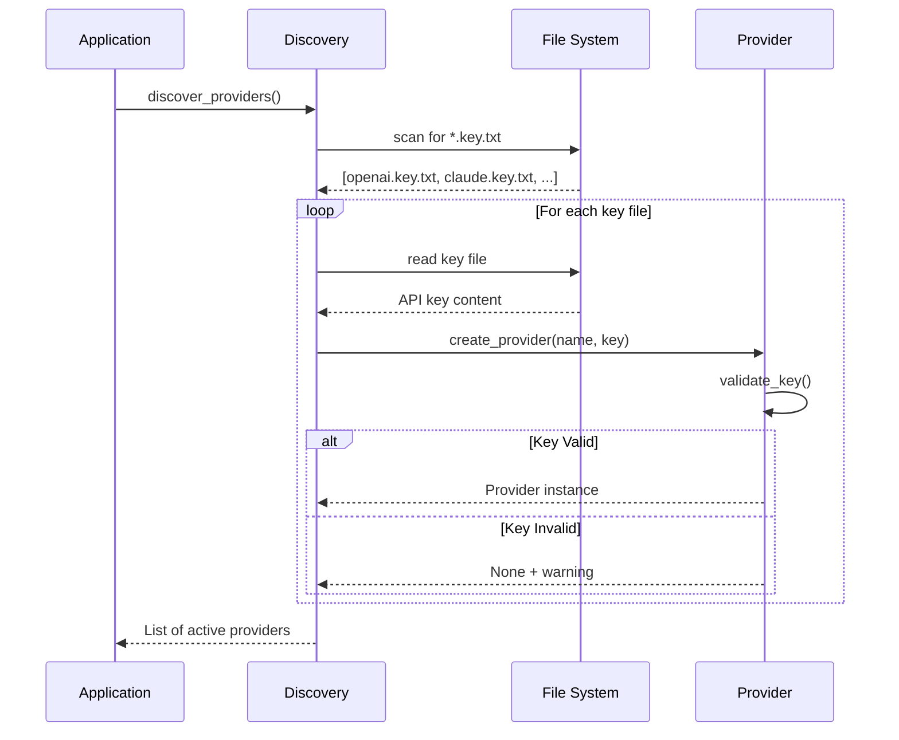

### Provider Class Hierarchy

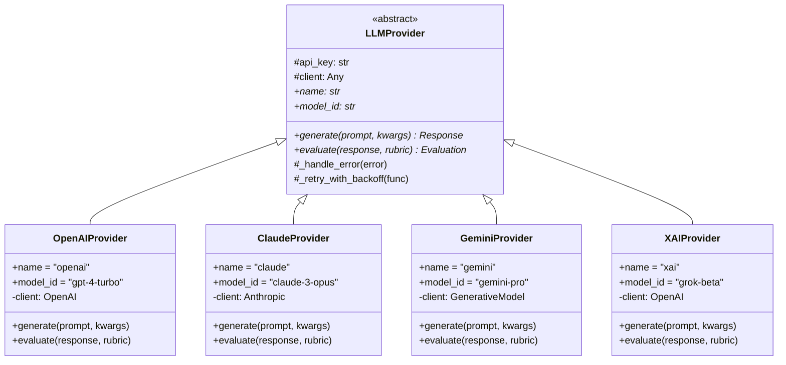

---

## Evaluation Pipeline

### Complete Pipeline Flow

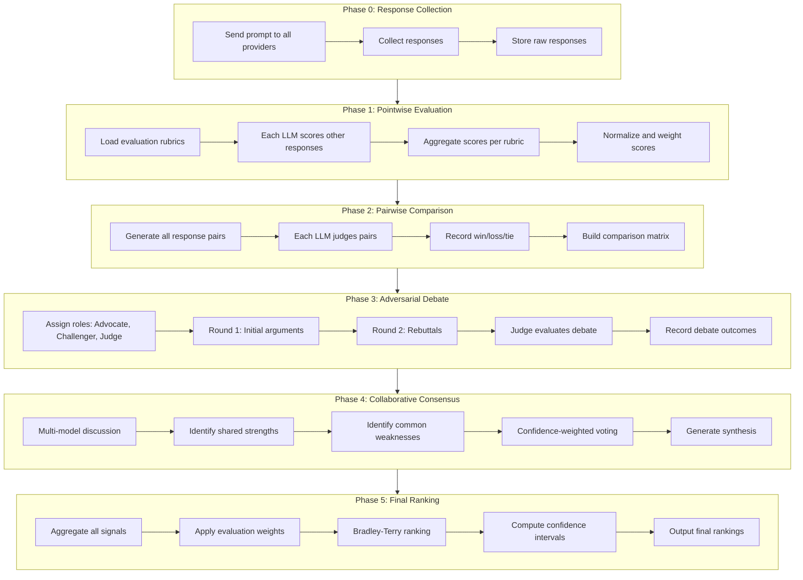

### Pointwise Evaluation Detail

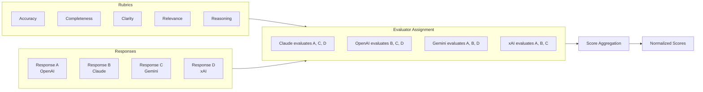

### Pairwise Comparison Matrix

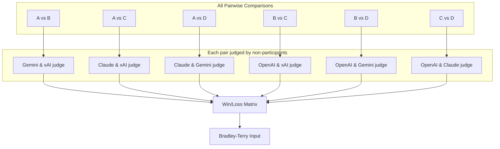

### Adversarial Debate Structure

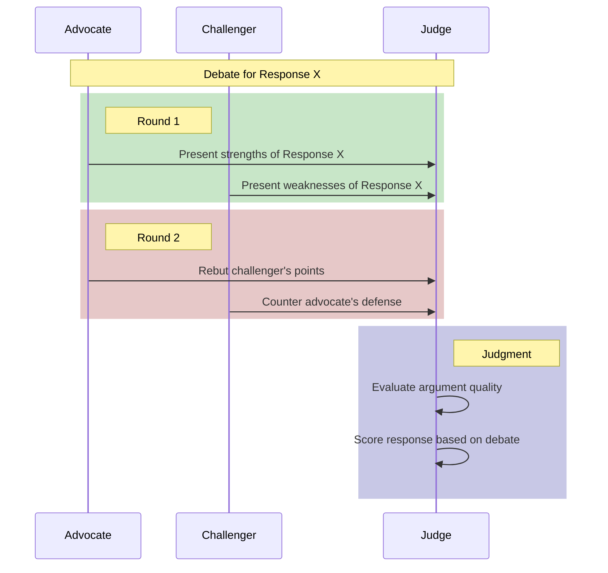

---

## Data Flow

### Session Data Structure

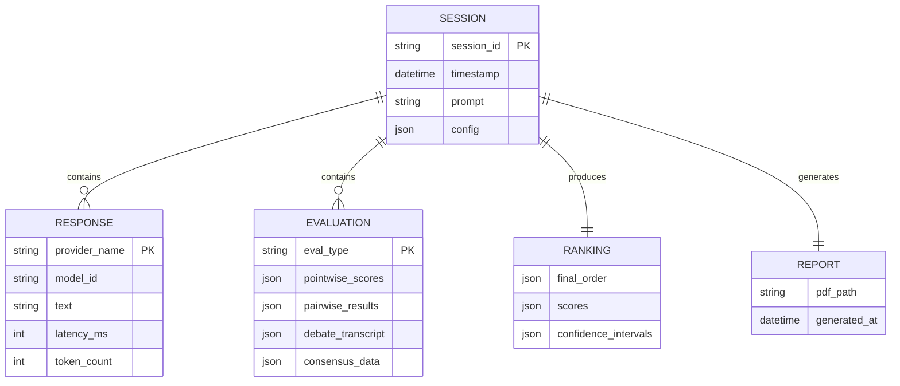

### File System Structure

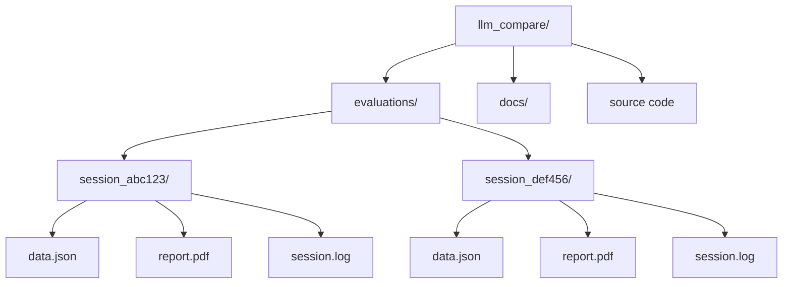

---

## API Integration Patterns

### Request/Response Flow

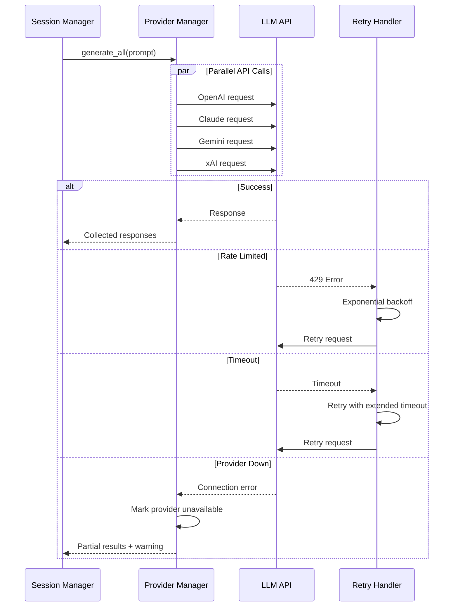

### Error Handling Strategy

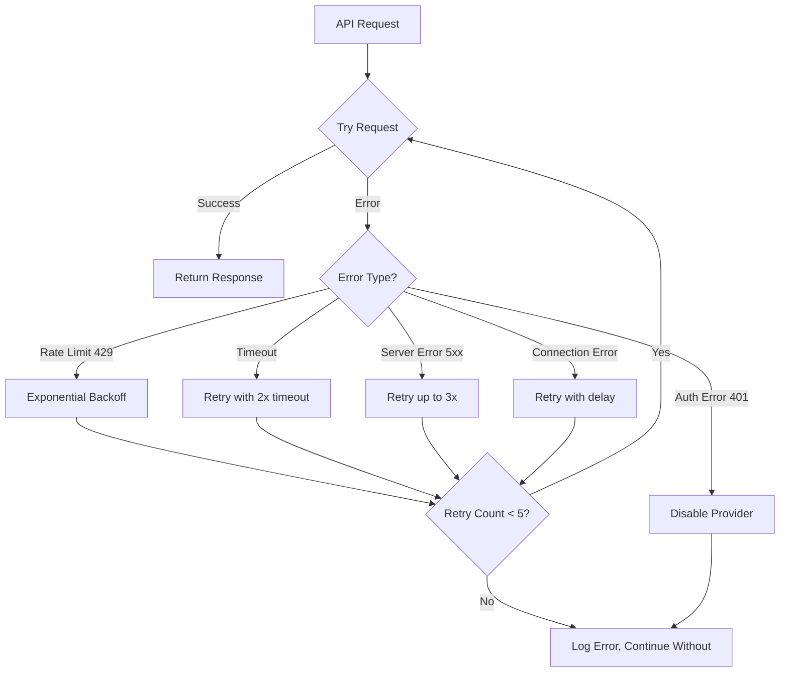

---

## Report Generation

### Report Structure

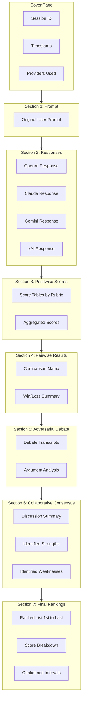

---

## Configuration System

### Configuration Hierarchy

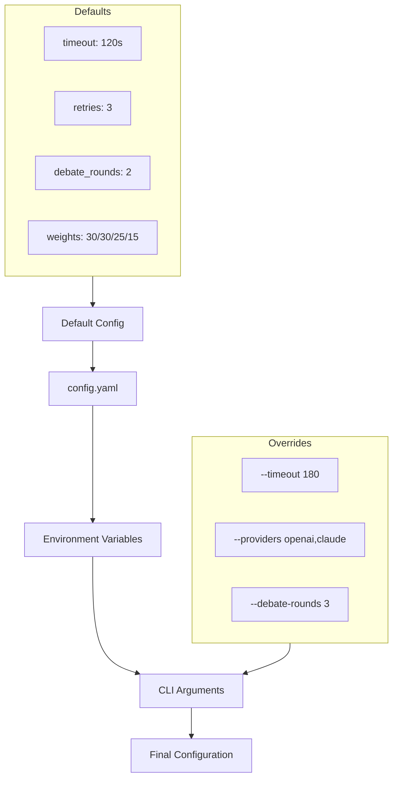

---

## Module Dependencies

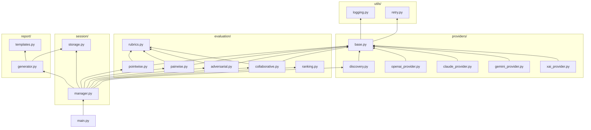

---

## Deployment View

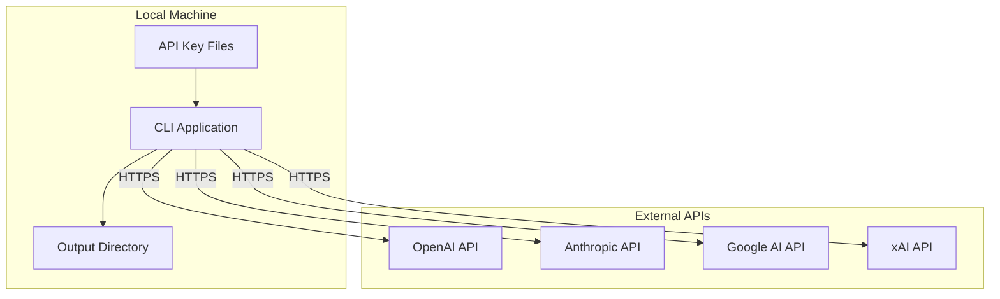
