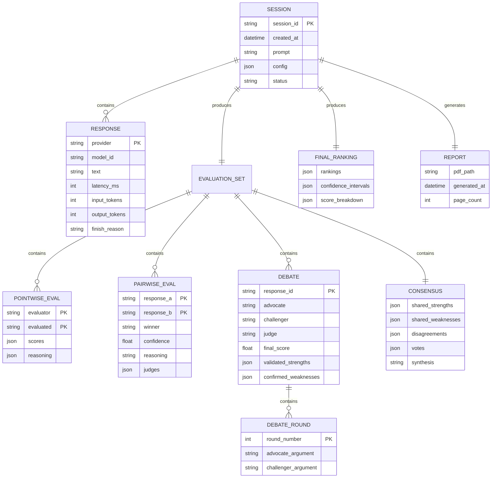
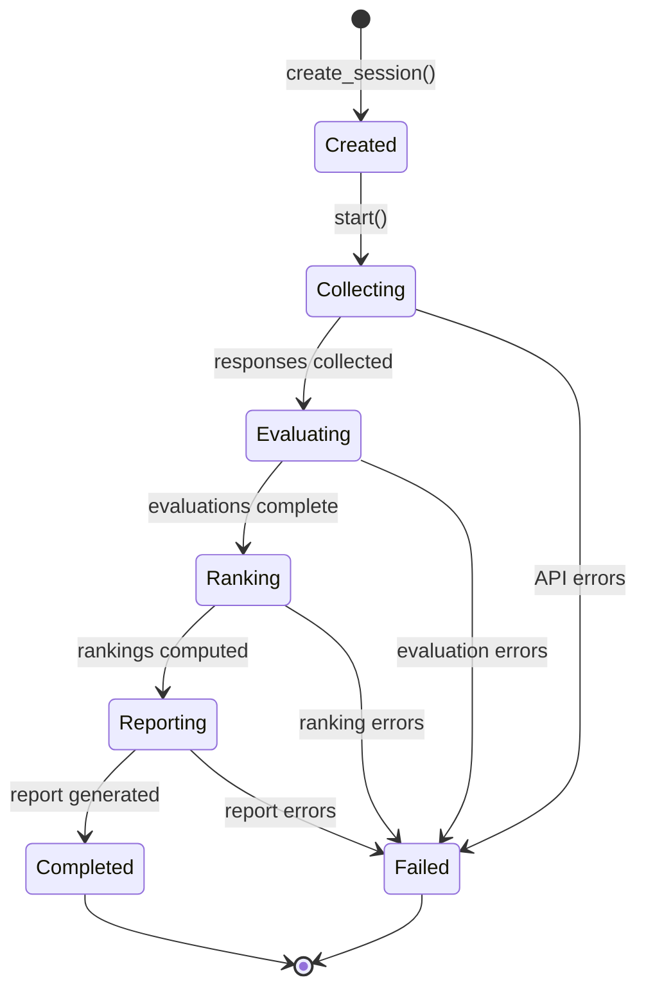
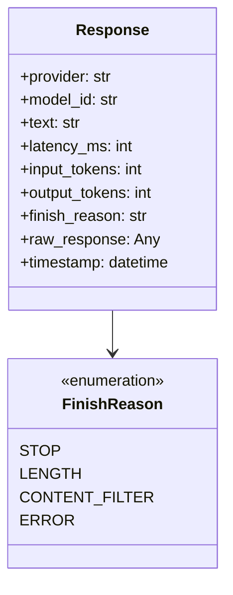
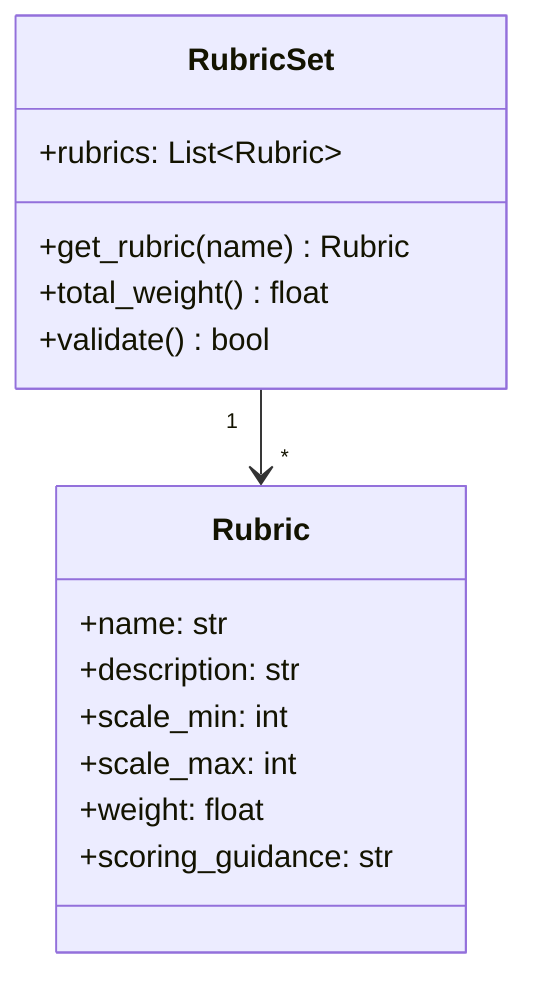
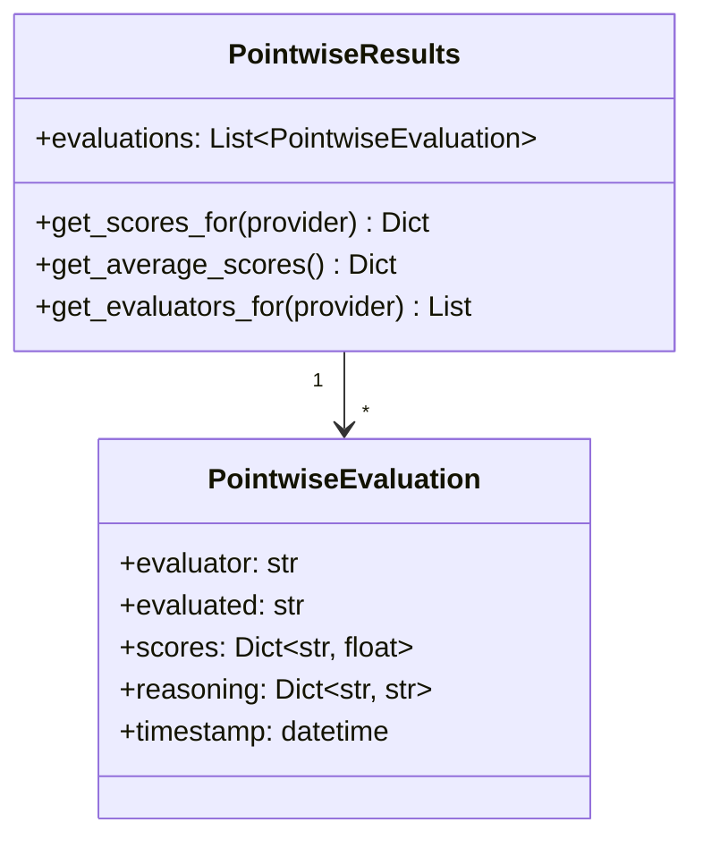
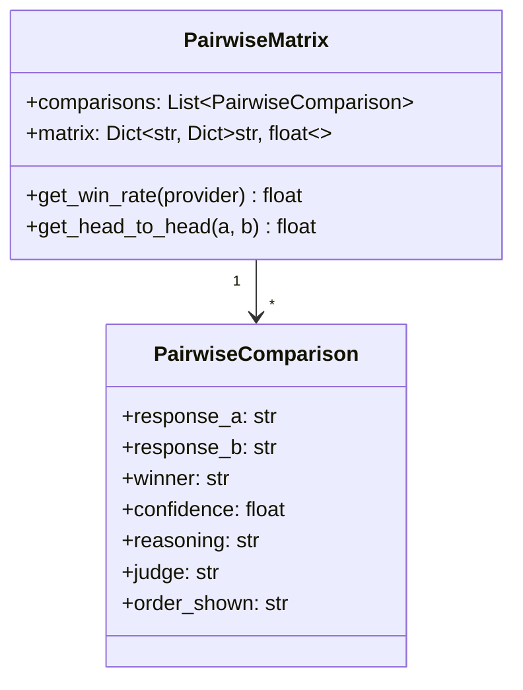
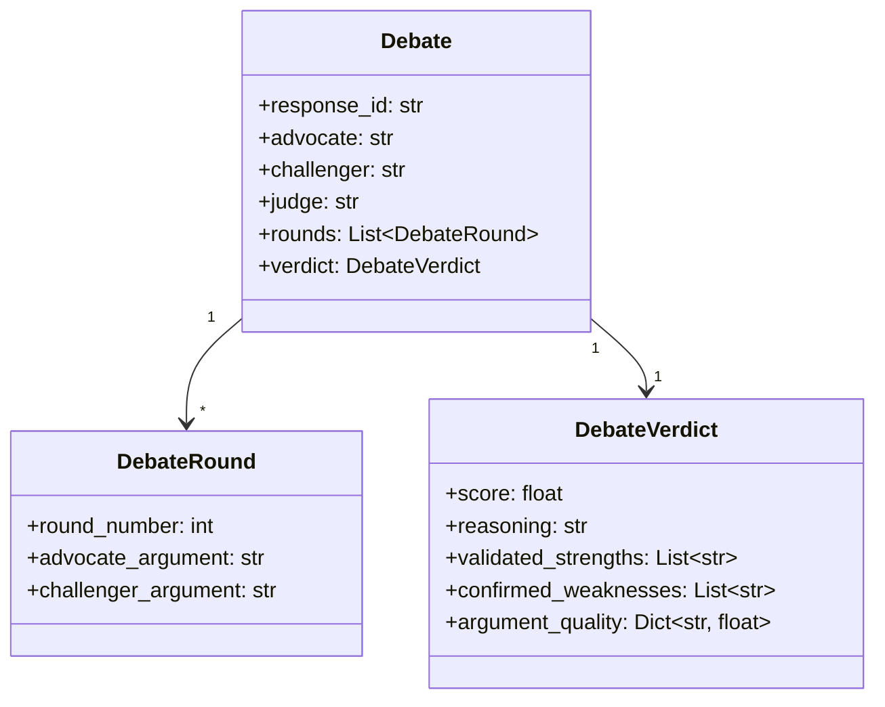
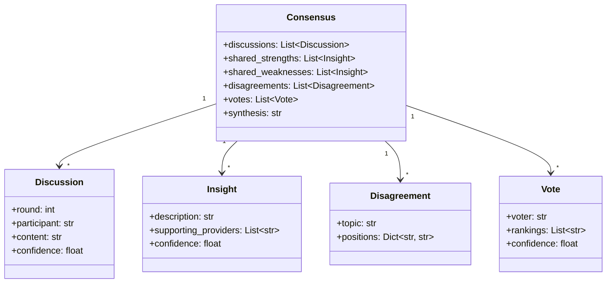
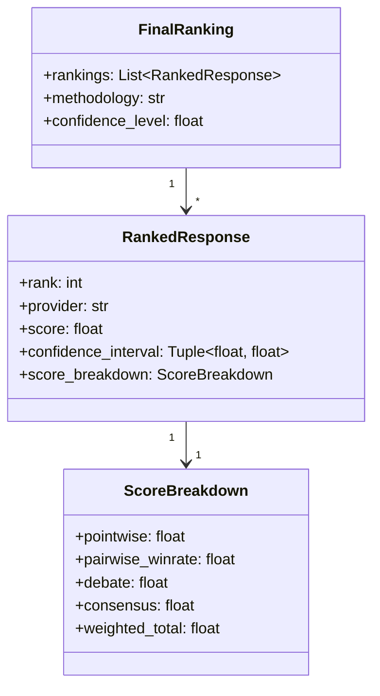
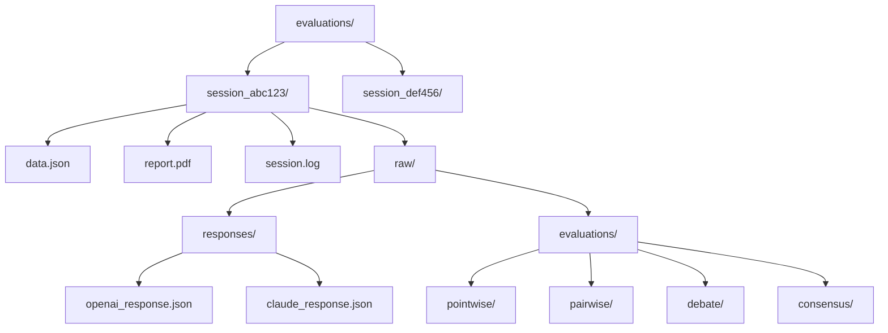

# Data Models Documentation

This document details all data structures used throughout the LLM Compare system.

## Core Data Models

### Entity Relationship Diagram



---

## Session Model

### Session Lifecycle



### Session Data Structure

```python
@dataclass
class Session:
    session_id: str              # UUID v4
    created_at: datetime         # ISO 8601 timestamp
    prompt: str                  # Original user prompt
    config: SessionConfig        # Configuration used
    status: SessionStatus        # Current lifecycle state
    responses: Dict[str, Response]
    evaluations: EvaluationSet
    rankings: FinalRanking
    report: Optional[Report]
    metadata: SessionMetadata

@dataclass
class SessionConfig:
    providers: List[str]         # Active providers
    timeout: int                 # API timeout in seconds
    debate_rounds: int           # Number of debate rounds
    weights: EvaluationWeights   # Phase weights
    rubrics: List[Rubric]        # Evaluation rubrics

@dataclass
class SessionMetadata:
    total_tokens: int
    total_cost_usd: float
    total_duration_ms: int
    provider_stats: Dict[str, ProviderStats]
```

### JSON Serialization

```json
{
  "session_id": "550e8400-e29b-41d4-a716-446655440000",
  "created_at": "2024-12-09T15:30:00Z",
  "prompt": "Explain quantum entanglement in simple terms",
  "config": {
    "providers": ["openai", "claude", "gemini", "xai"],
    "timeout": 120,
    "debate_rounds": 2,
    "weights": {
      "pointwise": 0.30,
      "pairwise": 0.30,
      "adversarial": 0.25,
      "collaborative": 0.15
    }
  },
  "status": "completed",
  "responses": {...},
  "evaluations": {...},
  "rankings": {...},
  "metadata": {
    "total_tokens": 45000,
    "total_cost_usd": 2.34,
    "total_duration_ms": 89000
  }
}
```

---

## Response Model

### Response Structure



### Response JSON

```json
{
  "openai": {
    "provider": "openai",
    "model_id": "gpt-4-turbo",
    "text": "Quantum entanglement is a phenomenon where...",
    "latency_ms": 2340,
    "input_tokens": 45,
    "output_tokens": 512,
    "finish_reason": "stop",
    "timestamp": "2024-12-09T15:30:05Z"
  },
  "claude": {
    "provider": "claude",
    "model_id": "claude-3-opus-20240229",
    "text": "Imagine you have two particles that...",
    "latency_ms": 3120,
    "input_tokens": 48,
    "output_tokens": 487,
    "finish_reason": "stop",
    "timestamp": "2024-12-09T15:30:06Z"
  }
}
```

---

## Evaluation Models

### Rubric Model



### Default Rubrics JSON

```json
{
  "rubrics": [
    {
      "name": "accuracy",
      "description": "Factual correctness and precision of information",
      "scale_min": 0,
      "scale_max": 10,
      "weight": 0.25,
      "scoring_guidance": "10: Completely accurate, no errors. 7-9: Mostly accurate with minor issues. 4-6: Some accuracy issues. 1-3: Significant errors. 0: Completely wrong."
    },
    {
      "name": "completeness",
      "description": "Coverage of all relevant aspects of the prompt",
      "scale_min": 0,
      "scale_max": 10,
      "weight": 0.20,
      "scoring_guidance": "10: Addresses all aspects thoroughly. 7-9: Covers most aspects well. 4-6: Partial coverage. 1-3: Major gaps. 0: Does not address the prompt."
    },
    {
      "name": "clarity",
      "description": "Clear, understandable communication",
      "scale_min": 0,
      "scale_max": 10,
      "weight": 0.20,
      "scoring_guidance": "10: Crystal clear, excellent organization. 7-9: Clear with minor issues. 4-6: Somewhat unclear. 1-3: Confusing. 0: Incomprehensible."
    },
    {
      "name": "relevance",
      "description": "Direct applicability to the prompt",
      "scale_min": 0,
      "scale_max": 10,
      "weight": 0.20,
      "scoring_guidance": "10: Perfectly relevant throughout. 7-9: Mostly relevant. 4-6: Some irrelevant content. 1-3: Mostly irrelevant. 0: Completely off-topic."
    },
    {
      "name": "reasoning",
      "description": "Quality of logic, argumentation, and analysis",
      "scale_min": 0,
      "scale_max": 10,
      "weight": 0.15,
      "scoring_guidance": "10: Excellent logical structure and reasoning. 7-9: Good reasoning with minor gaps. 4-6: Average reasoning. 1-3: Poor logic. 0: No reasoning present."
    }
  ]
}
```

### Pointwise Evaluation Model



### Pointwise JSON

```json
{
  "pointwise": {
    "evaluations": [
      {
        "evaluator": "claude",
        "evaluated": "openai",
        "scores": {
          "accuracy": 8.5,
          "completeness": 7.0,
          "clarity": 9.0,
          "relevance": 8.0,
          "reasoning": 7.5
        },
        "reasoning": {
          "accuracy": "The response correctly explains the core concept but oversimplifies...",
          "completeness": "Covers the basics but misses the EPR paradox implications...",
          "clarity": "Very well structured with good use of analogies...",
          "relevance": "Stays on topic throughout...",
          "reasoning": "Good logical flow but some jumps in explanation..."
        },
        "timestamp": "2024-12-09T15:31:00Z"
      }
    ],
    "aggregated": {
      "openai": {
        "accuracy": 8.2,
        "completeness": 7.3,
        "clarity": 8.5,
        "relevance": 8.1,
        "reasoning": 7.8,
        "overall": 7.98
      }
    }
  }
}
```

### Pairwise Comparison Model



### Pairwise JSON

```json
{
  "pairwise": {
    "comparisons": [
      {
        "response_a": "openai",
        "response_b": "claude",
        "winner": "claude",
        "confidence": 0.75,
        "reasoning": "Response B provides more concrete examples and better addresses...",
        "judge": "gemini",
        "order_shown": "a_first"
      },
      {
        "response_a": "openai",
        "response_b": "claude",
        "winner": "tie",
        "confidence": 0.55,
        "reasoning": "Both responses are comparable in quality...",
        "judge": "xai",
        "order_shown": "b_first"
      }
    ],
    "matrix": {
      "openai": {"claude": 0.25, "gemini": 0.75, "xai": 0.50},
      "claude": {"openai": 0.75, "gemini": 1.00, "xai": 0.75},
      "gemini": {"openai": 0.25, "claude": 0.00, "xai": 0.25},
      "xai": {"openai": 0.50, "claude": 0.25, "gemini": 0.75}
    },
    "win_rates": {
      "openai": 0.50,
      "claude": 0.83,
      "gemini": 0.17,
      "xai": 0.50
    }
  }
}
```

### Adversarial Debate Model



### Debate JSON

```json
{
  "adversarial": {
    "debates": [
      {
        "response_id": "openai",
        "advocate": "claude",
        "challenger": "gemini",
        "judge": "xai",
        "rounds": [
          {
            "round_number": 1,
            "advocate_argument": "This response excels in providing an accessible explanation of quantum entanglement. Key strengths include: 1) Use of relatable analogies...",
            "challenger_argument": "While the response is accessible, it has significant issues: 1) The coin analogy is misleading because..."
          },
          {
            "round_number": 2,
            "advocate_argument": "Addressing the challenger's concerns: The coin analogy, while imperfect, serves an important pedagogical purpose...",
            "challenger_argument": "The advocate's defense of the coin analogy misses the point. The fundamental issue is..."
          }
        ],
        "verdict": {
          "score": 7.5,
          "reasoning": "After considering both arguments, the response demonstrates good accessibility but the technical accuracy concerns raised by the challenger are valid...",
          "validated_strengths": [
            "Accessible language and structure",
            "Effective use of analogies for initial understanding",
            "Good coverage of basic concepts"
          ],
          "confirmed_weaknesses": [
            "Coin analogy may create misconceptions",
            "Missing discussion of Bell's theorem",
            "Oversimplifies measurement problem"
          ],
          "argument_quality": {
            "advocate": 7.0,
            "challenger": 8.0
          }
        }
      }
    ]
  }
}
```

### Collaborative Consensus Model



### Consensus JSON

```json
{
  "collaborative": {
    "discussions": [
      {
        "round": 1,
        "participant": "openai",
        "content": "Reviewing all responses, I observe that the Claude response provides the most comprehensive coverage...",
        "confidence": 0.80
      }
    ],
    "shared_strengths": [
      {
        "description": "All responses correctly identify entanglement as correlation between particles",
        "supporting_providers": ["openai", "claude", "gemini", "xai"],
        "confidence": 0.95
      }
    ],
    "shared_weaknesses": [
      {
        "description": "None of the responses adequately explain why classical physics cannot explain entanglement",
        "supporting_providers": ["openai", "claude", "gemini"],
        "confidence": 0.75
      }
    ],
    "disagreements": [
      {
        "topic": "Use of analogies",
        "positions": {
          "openai": "Analogies are essential for accessibility",
          "gemini": "Analogies can create misconceptions and should be minimized"
        }
      }
    ],
    "votes": [
      {
        "voter": "openai",
        "rankings": ["claude", "openai", "xai", "gemini"],
        "confidence": 0.72
      }
    ],
    "synthesis": "The collective assessment indicates that Claude's response best balances accessibility with accuracy..."
  }
}
```

---

## Ranking Model

### Final Ranking Structure



### Ranking JSON

```json
{
  "rankings": {
    "methodology": "bradley_terry_weighted",
    "confidence_level": 0.95,
    "rankings": [
      {
        "rank": 1,
        "provider": "claude",
        "score": 8.45,
        "confidence_interval": [8.12, 8.78],
        "score_breakdown": {
          "pointwise": 8.2,
          "pairwise_winrate": 0.83,
          "debate": 8.7,
          "consensus": 8.5,
          "weighted_total": 8.45
        }
      },
      {
        "rank": 2,
        "provider": "openai",
        "score": 8.21,
        "confidence_interval": [7.89, 8.53],
        "score_breakdown": {
          "pointwise": 7.98,
          "pairwise_winrate": 0.50,
          "debate": 7.5,
          "consensus": 7.8,
          "weighted_total": 8.21
        }
      },
      {
        "rank": 3,
        "provider": "xai",
        "score": 7.65,
        "confidence_interval": [7.21, 8.09],
        "score_breakdown": {
          "pointwise": 7.45,
          "pairwise_winrate": 0.50,
          "debate": 7.2,
          "consensus": 7.5,
          "weighted_total": 7.65
        }
      },
      {
        "rank": 4,
        "provider": "gemini",
        "score": 6.89,
        "confidence_interval": [6.45, 7.33],
        "score_breakdown": {
          "pointwise": 6.78,
          "pairwise_winrate": 0.17,
          "debate": 6.5,
          "consensus": 6.8,
          "weighted_total": 6.89
        }
      }
    ]
  }
}
```

---

## File Storage Structure

### Directory Layout



### Complete Session Data File

The `data.json` file contains all session data in a single file:

```json
{
  "version": "1.0",
  "session": {
    "session_id": "550e8400-e29b-41d4-a716-446655440000",
    "created_at": "2024-12-09T15:30:00Z",
    "completed_at": "2024-12-09T15:35:00Z",
    "prompt": "Explain quantum entanglement in simple terms",
    "config": {...},
    "status": "completed"
  },
  "responses": {...},
  "evaluations": {
    "pointwise": {...},
    "pairwise": {...},
    "adversarial": {...},
    "collaborative": {...}
  },
  "rankings": {...},
  "metadata": {
    "total_tokens": 45000,
    "total_cost_usd": 2.34,
    "total_duration_ms": 89000,
    "provider_stats": {
      "openai": {
        "tokens": 12000,
        "cost_usd": 0.85,
        "latency_ms": 2340,
        "requests": 8
      }
    }
  }
}
```
