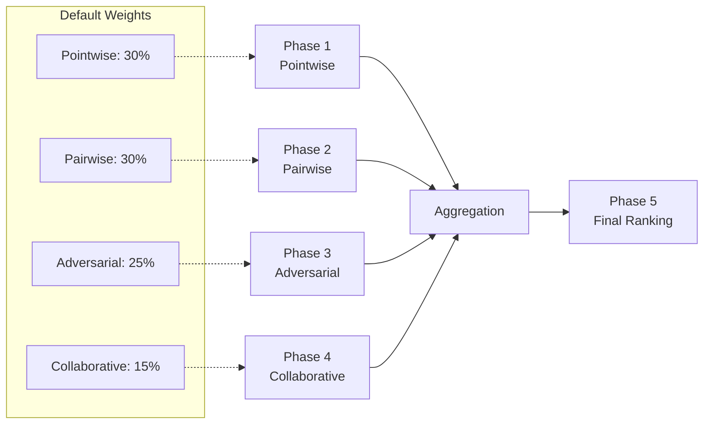
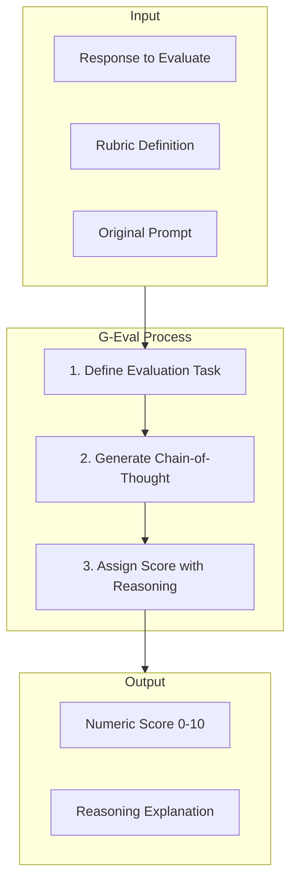
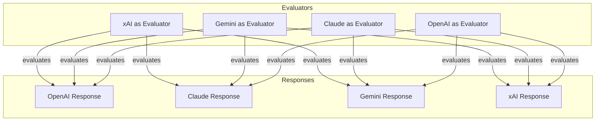
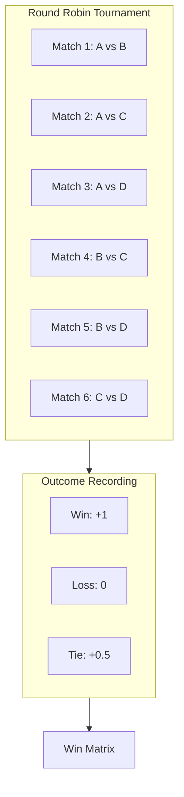
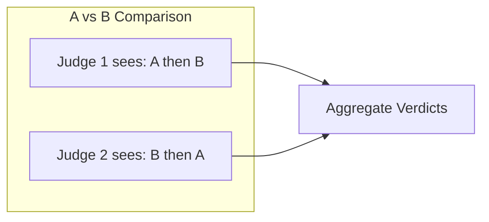
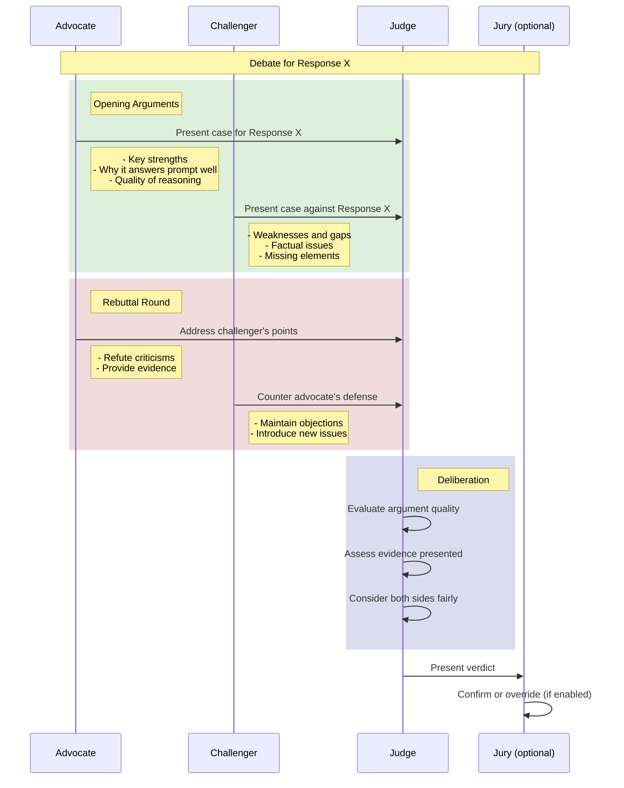
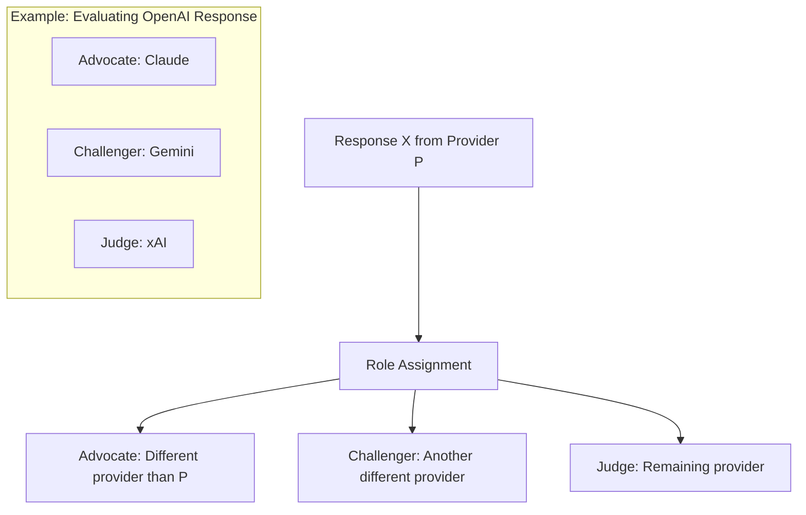
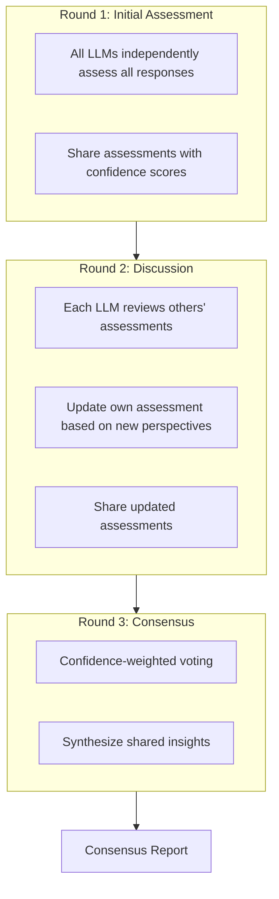
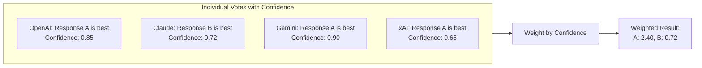
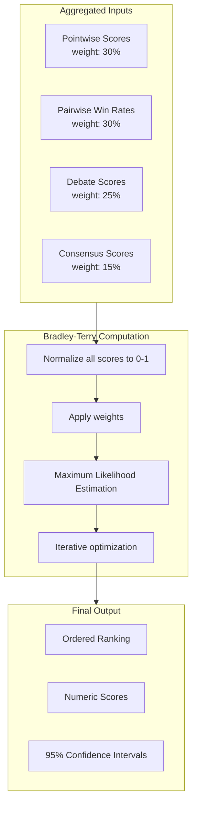

# Evaluation Pipeline Documentation

This document details the evaluation pipeline used to assess and rank LLM responses.

## Pipeline Overview

The evaluation pipeline consists of five distinct phases, each contributing to the final ranking with configurable weights.



---

## Phase 1: Pointwise Evaluation

### Purpose
Score each response independently against defined rubrics using G-Eval methodology.

### Method: G-Eval with Chain-of-Thought

Based on research from [G-Eval: NLG Evaluation using GPT-4](https://arxiv.org/abs/2303.16634), this phase uses structured Chain-of-Thought prompting for consistent scoring.



### Default Rubrics

| Rubric | Description | Weight |
|--------|-------------|--------|
| Accuracy | Factual correctness and precision | 25% |
| Completeness | Coverage of all aspects of the prompt | 20% |
| Clarity | Clear, understandable communication | 20% |
| Relevance | Direct applicability to the prompt | 20% |
| Reasoning | Quality of logic and argumentation | 15% |

### Cross-Evaluation Matrix

Each LLM evaluates all responses except its own to prevent self-bias.



### Score Aggregation

```
Final_Pointwise_Score(Response_X) =
    mean(scores from all evaluators) * rubric_weights
```

---

## Phase 2: Pairwise Comparison

### Purpose
Direct head-to-head comparisons to capture relative quality that absolute scores may miss.

### Method: Tournament-Style Comparison

Based on [Chatbot Arena](https://lmsys.org/blog/2023-12-07-leaderboard/) methodology.



### Position Bias Mitigation

To prevent order bias, each pair is presented in both orders to different judges:



### Judge Assignment

Judges are LLMs not involved in the comparison being judged:

| Comparison | Judges |
|------------|--------|
| OpenAI vs Claude | Gemini, xAI |
| OpenAI vs Gemini | Claude, xAI |
| OpenAI vs xAI | Claude, Gemini |
| Claude vs Gemini | OpenAI, xAI |
| Claude vs xAI | OpenAI, Gemini |
| Gemini vs xAI | OpenAI, Claude |

### Win Matrix Output

```
          OpenAI  Claude  Gemini  xAI
OpenAI      -      0.5     1.0    1.0
Claude     0.5      -      1.0    0.5
Gemini     0.0     0.0      -     0.5
xAI        0.0     0.5     0.5     -
```

---

## Phase 3: Adversarial Debate

### Purpose
Use structured argumentation to surface non-obvious strengths and weaknesses.

### Method: D3 Framework (Debate, Deliberate, Decide)

Based on [D3: Adversarial Multi-Agent Evaluation](https://arxiv.org/abs/2410.04663).



### Role Assignment Strategy

For each response being debated:



### Debate Scoring Criteria

| Criterion | Description |
|-----------|-------------|
| Argument Strength | Quality of reasoning and evidence |
| Responsiveness | How well rebuttals address points |
| Completeness | Coverage of relevant aspects |
| Fairness | Objectivity and acknowledgment of valid counterpoints |

### Output Structure

```json
{
  "response_debated": "openai",
  "advocate": "claude",
  "challenger": "gemini",
  "judge": "xai",
  "rounds": [
    {
      "round": 1,
      "advocate_argument": "...",
      "challenger_argument": "..."
    },
    {
      "round": 2,
      "advocate_rebuttal": "...",
      "challenger_rebuttal": "..."
    }
  ],
  "verdict": {
    "score": 7.5,
    "reasoning": "...",
    "key_strengths_validated": ["..."],
    "key_weaknesses_confirmed": ["..."]
  }
}
```

---

## Phase 4: Collaborative Consensus

### Purpose
Use multi-model collaboration to identify emergent insights and build consensus.

### Method: ReConcile-Style Consensus Building

Based on [ReConcile: Multi-Model Consensus](https://arxiv.org/abs/2309.13007).



### Confidence-Weighted Voting

Each LLM provides assessments with confidence levels:



### Consensus Outputs

1. **Shared Strengths**: Qualities all evaluators agree are positive
2. **Shared Weaknesses**: Issues all evaluators identify
3. **Points of Disagreement**: Areas where evaluators differ
4. **Synthesis**: Combined insight from multiple perspectives

---

## Phase 5: Final Ranking

### Purpose
Aggregate all evaluation signals into a definitive ranking.

### Method: Bradley-Terry Model

Based on [Bradley-Terry statistical model](https://en.wikipedia.org/wiki/Bradley%E2%80%93Terry_model) used by Chatbot Arena.



### Bradley-Terry Formula

For items i and j, the probability that i beats j:

```
P(i > j) = exp(beta_i) / (exp(beta_i) + exp(beta_j))
```

Where beta values are estimated via maximum likelihood from observed comparisons.

### Final Score Calculation

```python
final_score = (
    0.30 * normalized_pointwise_score +
    0.30 * normalized_pairwise_winrate +
    0.25 * normalized_debate_score +
    0.15 * normalized_consensus_score
)

# Bradley-Terry refinement
bt_scores = bradley_terry_mle(pairwise_matrix)
final_ranking = weighted_merge(final_score, bt_scores)
```

### Output Format

```json
{
  "rankings": [
    {
      "rank": 1,
      "provider": "claude",
      "score": 8.45,
      "confidence_interval": [8.12, 8.78],
      "breakdown": {
        "pointwise": 8.2,
        "pairwise_winrate": 0.83,
        "debate": 8.7,
        "consensus": 8.5
      }
    },
    {
      "rank": 2,
      "provider": "openai",
      "score": 8.21,
      "confidence_interval": [7.89, 8.53],
      "breakdown": {...}
    }
  ]
}
```

---

## Evaluation Prompts

### Pointwise Evaluation Prompt Template

```
You are evaluating an AI response to the following prompt:

ORIGINAL PROMPT:
{prompt}

RESPONSE TO EVALUATE:
{response}

EVALUATION RUBRIC - {rubric_name}:
{rubric_description}

Please evaluate this response on a scale of 0-10 for {rubric_name}.

First, think through your evaluation step by step:
1. What aspects of {rubric_name} does this response demonstrate well?
2. What aspects are lacking or could be improved?
3. How does it compare to an ideal response?

Then provide your final score and a brief justification.

OUTPUT FORMAT:
REASONING: [Your step-by-step analysis]
SCORE: [0-10]
JUSTIFICATION: [Brief explanation of score]
```

### Pairwise Comparison Prompt Template

```
You are comparing two AI responses to the same prompt.

ORIGINAL PROMPT:
{prompt}

RESPONSE A:
{response_a}

RESPONSE B:
{response_b}

Which response better answers the prompt? Consider:
- Accuracy and correctness
- Completeness and depth
- Clarity and coherence
- Relevance to the question

Provide your analysis and verdict.

OUTPUT FORMAT:
ANALYSIS: [Your comparison analysis]
VERDICT: [A, B, or TIE]
CONFIDENCE: [0.0 to 1.0]
REASONING: [Brief explanation of verdict]
```

### Adversarial Debate Prompt Templates

**Advocate Prompt:**
```
You are the ADVOCATE for the following response. Your job is to present
the strongest case for why this is a good response.

ORIGINAL PROMPT: {prompt}
RESPONSE YOU ARE DEFENDING: {response}

Present your opening argument highlighting:
1. Key strengths of this response
2. How well it addresses the prompt
3. Quality of reasoning or information provided
4. Any unique value it provides

Be persuasive but truthful - do not fabricate strengths.
```

**Challenger Prompt:**
```
You are the CHALLENGER against the following response. Your job is to
identify weaknesses and issues.

ORIGINAL PROMPT: {prompt}
RESPONSE YOU ARE CHALLENGING: {response}
ADVOCATE'S ARGUMENT: {advocate_argument}

Present your challenge highlighting:
1. Weaknesses or gaps in the response
2. Factual errors or questionable claims
3. Missing important information
4. Areas where it fails to address the prompt

Be critical but fair - acknowledge valid strengths while focusing on issues.
```

**Judge Prompt:**
```
You are the JUDGE evaluating a debate about the following response.

ORIGINAL PROMPT: {prompt}
RESPONSE BEING EVALUATED: {response}

ADVOCATE'S ARGUMENTS:
{advocate_arguments}

CHALLENGER'S ARGUMENTS:
{challenger_arguments}

Evaluate the response based on the debate. Consider:
1. Which arguments were most compelling?
2. Were the advocate's claimed strengths valid?
3. Were the challenger's criticisms fair and accurate?
4. Overall, how good is this response?

OUTPUT FORMAT:
ANALYSIS: [Your evaluation of the debate]
VALIDATED_STRENGTHS: [List of confirmed strengths]
CONFIRMED_WEAKNESSES: [List of valid criticisms]
SCORE: [0-10]
REASONING: [Explanation of final judgment]
```
