# Provider Integration Documentation

This document details how LLM providers are discovered, configured, and used within the system.

## Provider Discovery

### Automatic Detection

Providers are automatically discovered based on API key files in the project root and local GGUF model files.

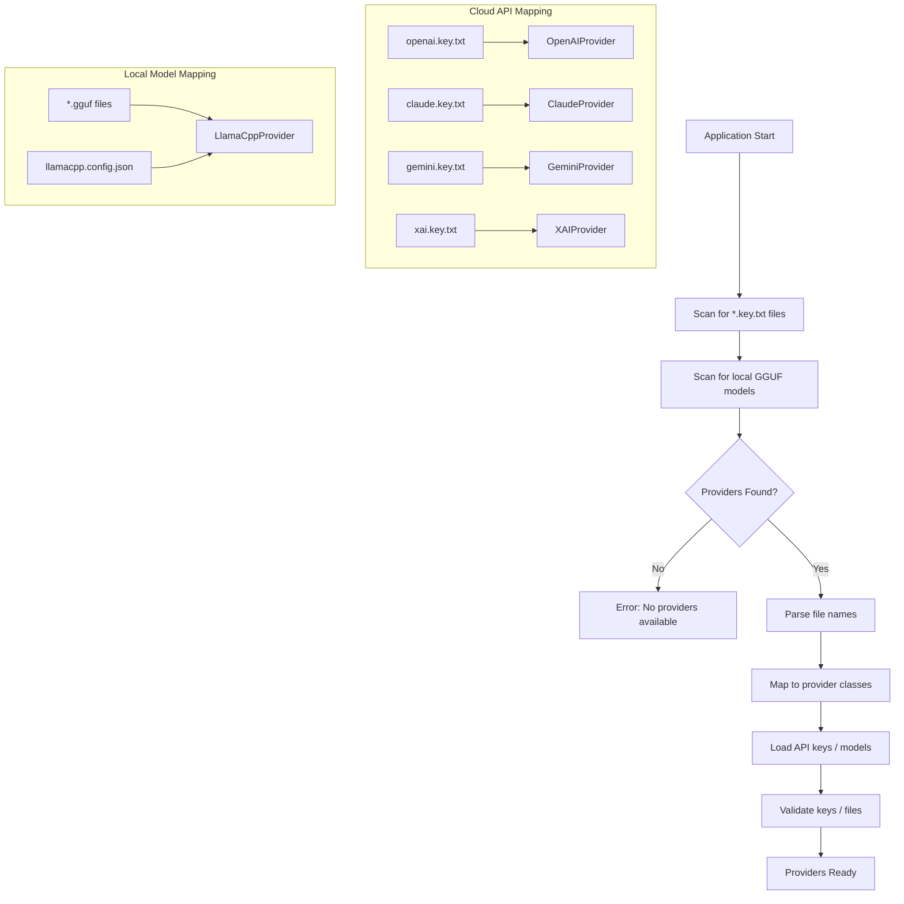

### Key File Format

Each key file contains the API key on the first line:

```
sk-proj-xxxxxxxxxxxxxxxxxxxxxxxxxxxxx
```

| File Name | Provider | API Endpoint |
|-----------|----------|--------------|
| `openai.key.txt` | OpenAI | api.openai.com |
| `claude.key.txt` | Anthropic | api.anthropic.com |
| `gemini.key.txt` | Google | generativelanguage.googleapis.com |
| `xai.key.txt` | xAI | api.x.ai |

### Local Model Configuration

Local GGUF models are discovered via:
1. **Auto-discovery**: Scanning `model_dirs` for `*.gguf` files
2. **Explicit config**: Models defined in `llamacpp.config.json`

See [llama.cpp Provider](#llamacpp-provider-local-models) section for details.

---

## Provider Interface

### Abstract Base Class

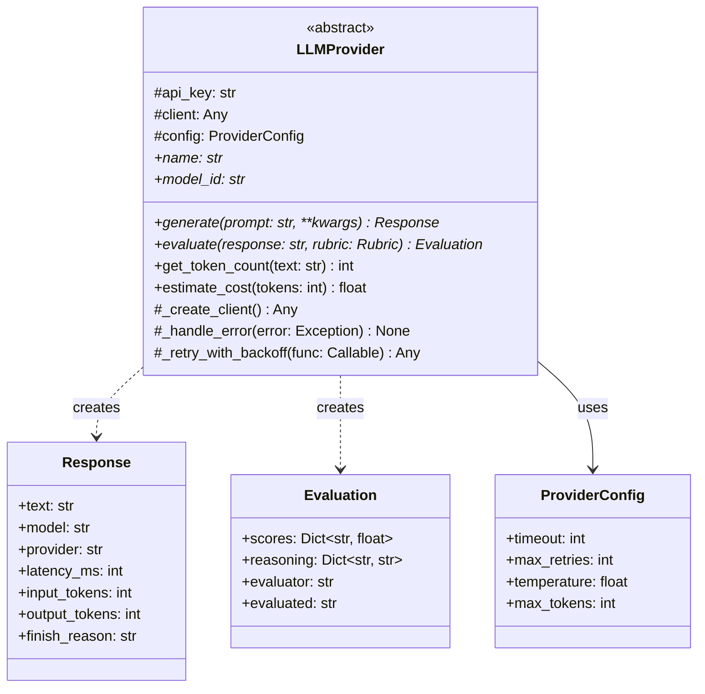

### Interface Methods

| Method | Description | Returns |
|--------|-------------|---------|
| `generate(prompt, **kwargs)` | Generate response to prompt | `Response` |
| `evaluate(response, rubric)` | Score a response against rubric | `Evaluation` |
| `get_token_count(text)` | Count tokens in text | `int` |
| `estimate_cost(tokens)` | Estimate API cost | `float` |

---

## Provider Implementations

### OpenAI Provider

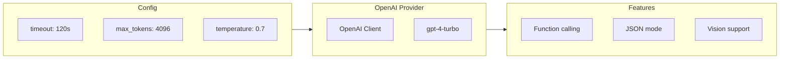

**Configuration:**
```python
class OpenAIProvider(LLMProvider):
    name = "openai"
    model_id = "gpt-4-turbo"

    default_config = {
        "timeout": 120,
        "max_tokens": 4096,
        "temperature": 0.7,
    }
```

**API Details:**
- Endpoint: `https://api.openai.com/v1/chat/completions`
- Authentication: Bearer token in header
- Rate limits: Varies by tier (TPM/RPM)

### Claude Provider

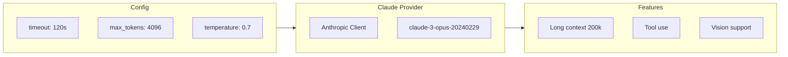

**Configuration:**
```python
class ClaudeProvider(LLMProvider):
    name = "claude"
    model_id = "claude-3-opus-20240229"

    default_config = {
        "timeout": 120,
        "max_tokens": 4096,
        "temperature": 0.7,
    }
```

**API Details:**
- Endpoint: `https://api.anthropic.com/v1/messages`
- Authentication: `x-api-key` header
- Rate limits: Varies by tier

### Gemini Provider

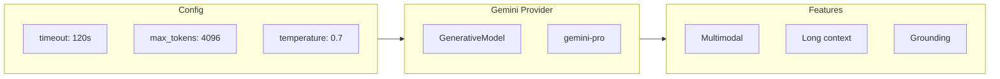

**Configuration:**
```python
class GeminiProvider(LLMProvider):
    name = "gemini"
    model_id = "gemini-pro"

    default_config = {
        "timeout": 120,
        "max_output_tokens": 4096,
        "temperature": 0.7,
    }
```

**API Details:**
- Uses `google-generativeai` SDK
- Authentication: API key in SDK configuration
- Different parameter naming (max_output_tokens vs max_tokens)

### xAI Provider

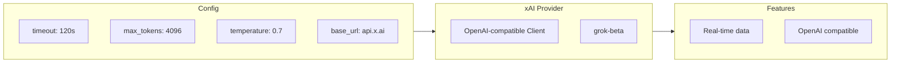

**Configuration:**
```python
class XAIProvider(LLMProvider):
    name = "xai"
    model_id = "grok-beta"

    default_config = {
        "timeout": 120,
        "max_tokens": 4096,
        "temperature": 0.7,
        "base_url": "https://api.x.ai/v1",
    }
```

**API Details:**
- Uses OpenAI client with custom base URL
- OpenAI-compatible API format
- Authentication: Bearer token

### llama.cpp Provider (Local Models)

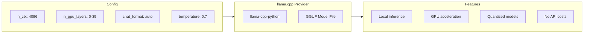

**Configuration:**
```python
class LlamaCppProvider(LLMProvider):
    name = "llamacpp-{model_name}"
    model_id = "{gguf_filename}"

    default_config = {
        "timeout": 300,
        "max_tokens": 4096,
        "temperature": 0.7,
        "n_ctx": 4096,
        "n_gpu_layers": 0,
    }
```

**Setup Requirements:**
- Install: `pip install llama-cpp-python`
- GPU support: `CMAKE_ARGS="-DLLAMA_CUDA=on" pip install llama-cpp-python`
- Place GGUF model files in configured directories

**Model Discovery:**

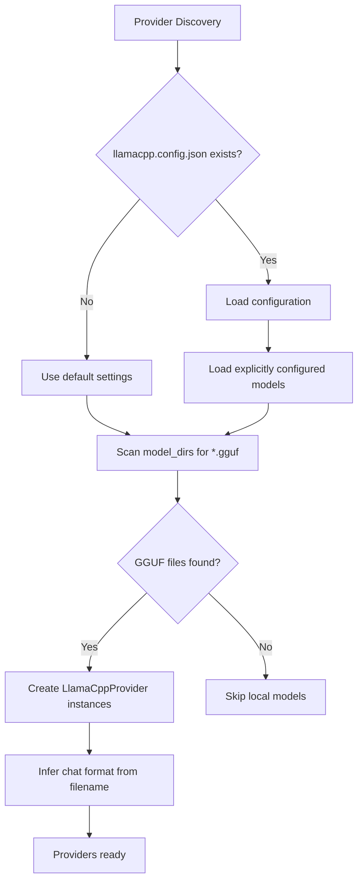

**Chat Format Inference:**

| Filename Pattern | Chat Format |
|------------------|-------------|
| `*llama-2*`, `*llama2*` | llama-2 |
| `*llama-3*`, `*llama3*` | llama-3 |
| `*mistral*` | mistral-instruct |
| `*qwen*`, `*phi*` | chatml |
| `*gemma*` | gemma |
| `*vicuna*` | vicuna |
| `*alpaca*` | alpaca |

**Configuration File (`llamacpp.config.json`):**
```json
{
  "model_dirs": ["./models", "~/models"],
  "default_n_ctx": 4096,
  "default_n_gpu_layers": 0,
  "models": {
    "llama3-8b": {
      "path": "./models/llama-3-8b-instruct.Q4_K_M.gguf",
      "n_ctx": 8192,
      "n_gpu_layers": 35,
      "chat_format": "llama-3"
    }
  }
}
```

**Key Differences from Cloud Providers:**
- No API key required
- Runs entirely locally
- No per-token costs
- Performance depends on hardware (CPU/GPU)
- Lazy loading: llama-cpp-python only imported when models are used

---

## Error Handling

### Error Categories

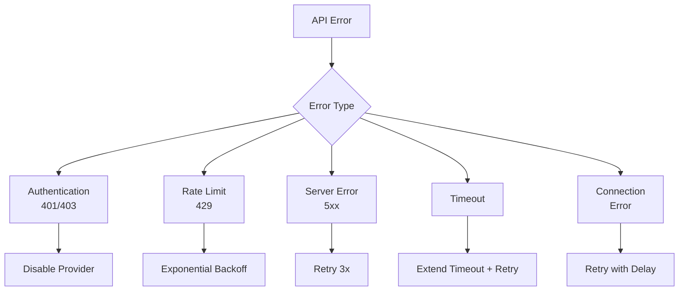

### Retry Strategy

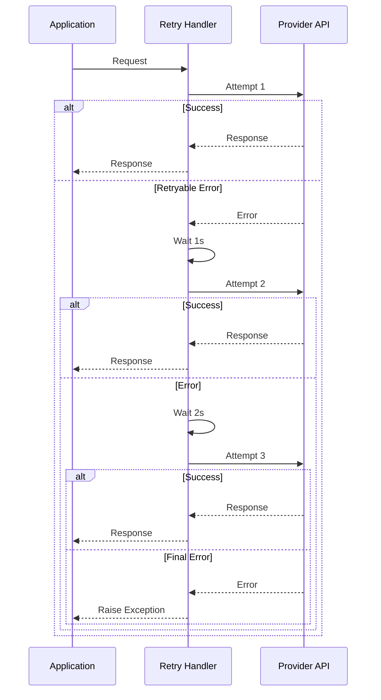

### Backoff Configuration

```python
retry_config = {
    "max_retries": 3,
    "initial_delay": 1.0,      # seconds
    "max_delay": 60.0,         # seconds
    "exponential_base": 2,
    "jitter": True,            # Add randomness to prevent thundering herd
}
```

---

## Concurrent Execution

### Parallel Request Pattern

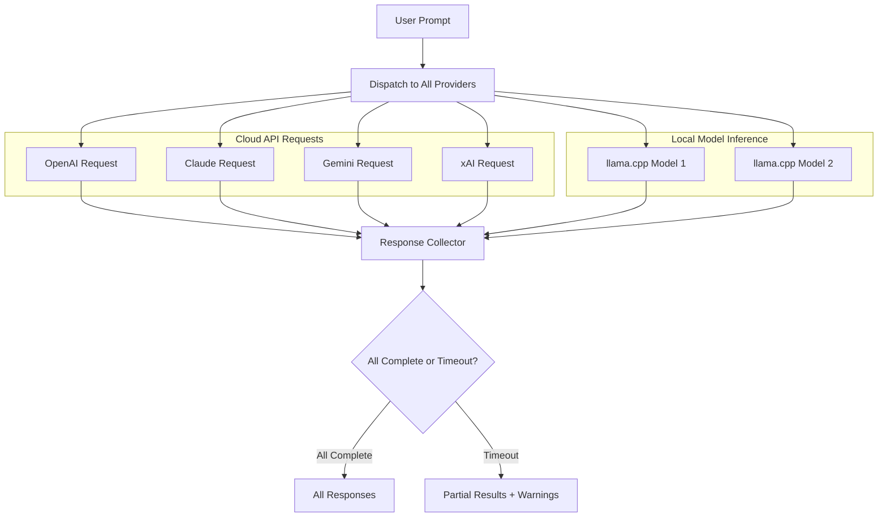

### Concurrency Control

```python
async def generate_all(prompt: str) -> Dict[str, Response]:
    semaphore = asyncio.Semaphore(4)  # Max concurrent requests

    async def bounded_generate(provider):
        async with semaphore:
            return await provider.generate(prompt)

    tasks = [bounded_generate(p) for p in self.providers]
    results = await asyncio.gather(*tasks, return_exceptions=True)

    return {
        p.name: r for p, r in zip(self.providers, results)
        if not isinstance(r, Exception)
    }
```

---

## Cost Tracking

### Token Counting

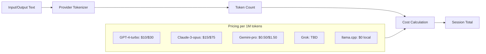

### Cost Estimation

```python
pricing = {
    "openai": {
        "gpt-4-turbo": {"input": 10.00, "output": 30.00},  # per 1M tokens
    },
    "claude": {
        "claude-3-opus": {"input": 15.00, "output": 75.00},
    },
    "gemini": {
        "gemini-pro": {"input": 0.50, "output": 1.50},
    },
    "llamacpp": {
        "*": {"input": 0.00, "output": 0.00},  # Local inference - no API cost
    },
}

def estimate_cost(provider: str, model: str, input_tokens: int, output_tokens: int) -> float:
    if provider.startswith("llamacpp"):
        return 0.0  # Local models have no API cost
    rates = pricing[provider][model]
    return (input_tokens * rates["input"] + output_tokens * rates["output"]) / 1_000_000
```

---

## Provider Health Monitoring

### Health Check Flow

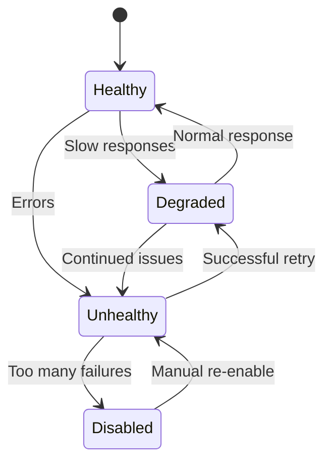

### Metrics Tracked

| Metric | Description | Alert Threshold |
|--------|-------------|-----------------|
| Latency | Response time | > 30s |
| Error Rate | Failed requests / total | > 10% |
| Timeout Rate | Timeouts / total | > 5% |
| Availability | Successful / attempted | < 95% |

---

## Adding New Providers

### Steps to Add a Cloud Provider

1. Create key file pattern (e.g., `newprovider.key.txt`)
2. Implement provider class extending `LLMProvider`
3. Register in provider discovery mapping
4. Add default configuration
5. Implement error handling specific to provider
6. Add cost tracking data

### Steps to Add a Local Provider

For local inference engines (like llama.cpp):
1. Create configuration file format (e.g., `engine.config.json`)
2. Implement provider class with lazy imports for optional dependencies
3. Add model discovery logic to scan for model files
4. Handle hardware-specific configuration (GPU layers, context size)
5. No API key or cost tracking needed

### Provider Template

```python
class NewProvider(LLMProvider):
    name = "newprovider"
    model_id = "model-name"

    default_config = {
        "timeout": 120,
        "max_tokens": 4096,
        "temperature": 0.7,
    }

    def _create_client(self):
        # Initialize API client
        pass

    def generate(self, prompt: str, **kwargs) -> Response:
        # Implement generation logic
        pass

    def evaluate(self, response: str, rubric: Rubric) -> Evaluation:
        # Implement evaluation logic (usually uses generate internally)
        pass
```
